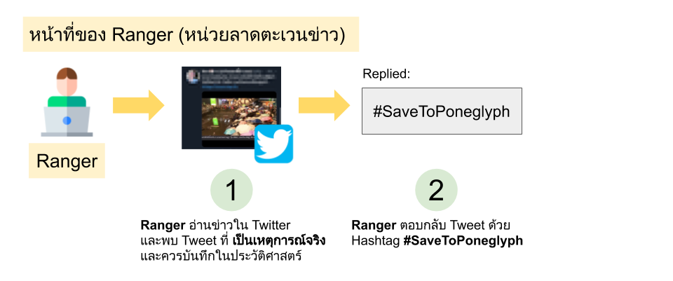
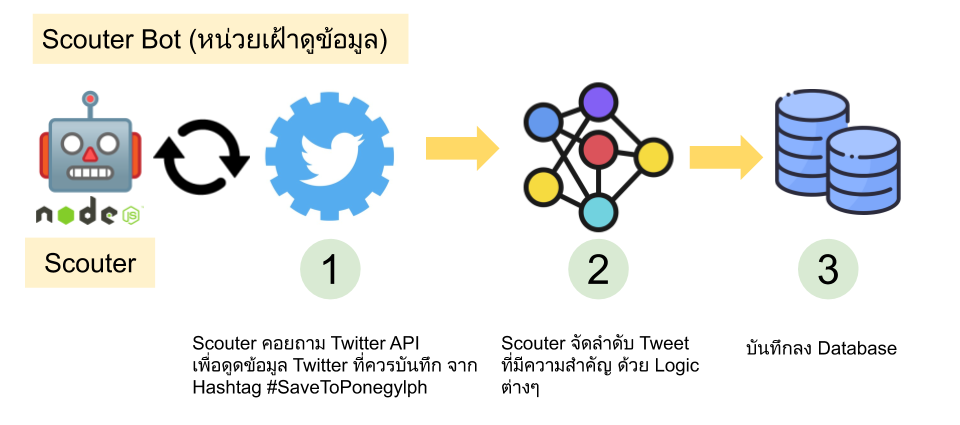
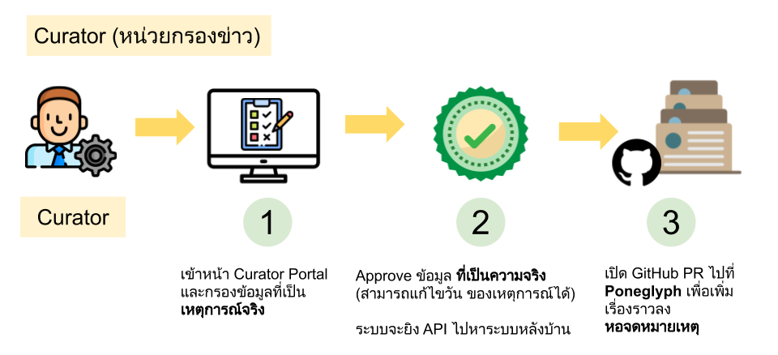
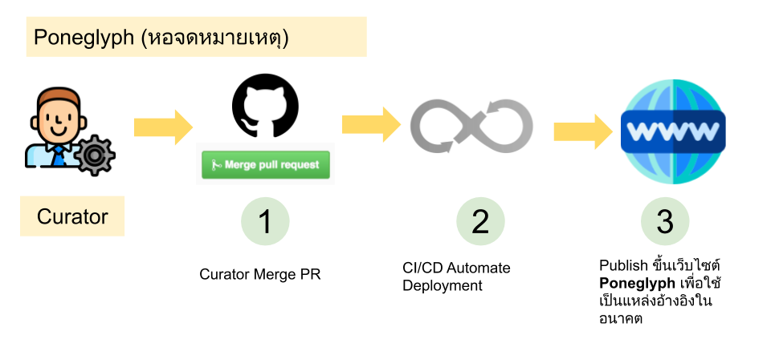

# Poneglyph (https://freedevth.github.io/poneglyph/)

## ความเป็นมา
- การจะเข้าใจความเคลื่อนไหวทางการเมืองไทย จำเป็นจะต้องศึกษาข้อมูลตั้งแต่อดีต ถึงปัจจุบัน แต่เรายังขาดเครื่องมือ ที่เก็บรวบรวมข้อมูลทางประวัติศาสตร์ ที่คอยอัพเดตตลอดเวลา
- โปรเจ็ค **Poneglpyh (โพเนกลีฟ)** จึงถือกำเนิดขึ้น เพื่อเป็น **หอจดหมายเหตุ** สำหรับรวบรวมบันทึกเหตุการณ์การเมือง ที่เกิดขึ้นในสังคมไทย ตั้งแต่อดีต ถึงปัจจุบัน

## Pain Points
1. **Information Overload**: เราอยู่ในยุคที่ข้อมูลล้นหลาม ข้อมูลต่างๆ ใน Twitter, Facebook ประกอบไปด้วย ข้อเท็จจริง, Fake News, Hate Speech, คำพูดเสียดสี และคำประชด ปะปนกันอยู่ในนั้น จนทำให้การหาข้อเท็จจริง มีความยากลำบาก
2. **Social Dilemma**: Social Platform ทุกตัวพยายามดึงความสนใจผู้ใช้ โดย Feed Content ที่ผู้ใช้ชอบ และทวีคูณยิ่งขึ้นไปเรื่อยๆ  ทำให้ผู้ใช้ ขาดข้อมูลที่ครบทั้งสองด้าน ส่งผลให้เกิดการแบ่งฝักแบ่งฝ่าย
3. **Learning Curve สูง**: การเข้าใจการเมืองไทย จำเป็นต้องศึกษาตัวละครต่างๆ แนวคิด และการตัดสินใจ จากสิ่งที่เกิดขึ้นในอดีต จนถึงปัจจุบัน ซึ่งใช้เวลาในการทำความเข้าใจนาน ส่งผลให้ ผู้คนหยุดสนใจที่จะทำความเข้าใจ

## วัตถุประสงค์
1. เพื่อเก็บบันทึกเรื่องราวทางประวัติศาสตร์ ทั้งทางตรง และทางอ้อม เพื่อใช้ในการอ้างอิง
2. เพื่อเป็นเครื่องมือตัวแรก ที่คนนึกถึง สำหรับใช้ในการเผยแพร่ ตอบคำถาม และ Educate สิ่งที่เกิดขึ้นในการเมืองไทย อย่างเข้าใจง่าย
2. เพื่อเผยแพร่ข้อมูลที่เป็นความจริง ของทุกฝ่าย

## ขั้นตอนการทำงาน

## DO and DON'T
| DO                                | DON'T                         |
|-----------------------------------|-------------------------------|
| เก็บบันทึกเหตุการณ์จริงที่เกิดขึ้น           | แสดงความคิดเห็น ต่อเหตุการณ์ที่เกิดขึ้น |
| จัดระเบียบ และแสดงอย่างเข้าใจง่าย      | ชี้นำ ผู้เข้าชมเว็บไซต์              |
| เผยแพร่ และตอบคำถาม เพื่อการ Educate | เผยแพร่ข้อมูลเท็จ และไม่เป็นความจริง |

## การนำเสนอ
### Phase 1 ###
1. นำเสนอในรูปแบบ Timeline ในระดับ ปี เดือน วัน และ Event (เช่น การชุมนุม)
2. แสดงเหตุการณ์ต่างๆ ที่ดึงมาจาก Social Platform โดยใน Phase 1 จะ Focus ที่ Twitter เป็นหลัก

### Phase 2 ##
1. TBD

## เงื่อนไข Tweet ที่เหมาะสม
- มีรูป หรือ Clip Video ประกอบ
- มีพยานหลักฐานชัดเจน
- ข้อความเน้นการ Educate ไม่ใช้ Hate speech, ปะชดประชัน หรือ สร้างความแตกแยก

## หลักการออกแบบ (Design Principle)
1. **Easy to use**: เครื่องมือต้องใช้งานง่าย เข้าใจง่าย
2. **Minimal / Light-weight**: เครื่องมือนี้ต้องเรียบง่าย มีน้ำหนักเบา Foot-print ต่ำ
3. **No / Less Maintenance**: ไม่ต้องได้รับการดูแล หรือได้รับการดูแลน้อยมาก
4. **High Reliability**: เว็บไซต์ต้องพร้อมใช้งานเสมอ และเข้าถึงได้อย่างรวดเร็ว
5. **Everything-as-a-code**: Concept ที่เน้นเก็บทุกอย่างลงบน Code เพื่อการตรวจสอบ และ History Tracing

## LICENSE
MIT